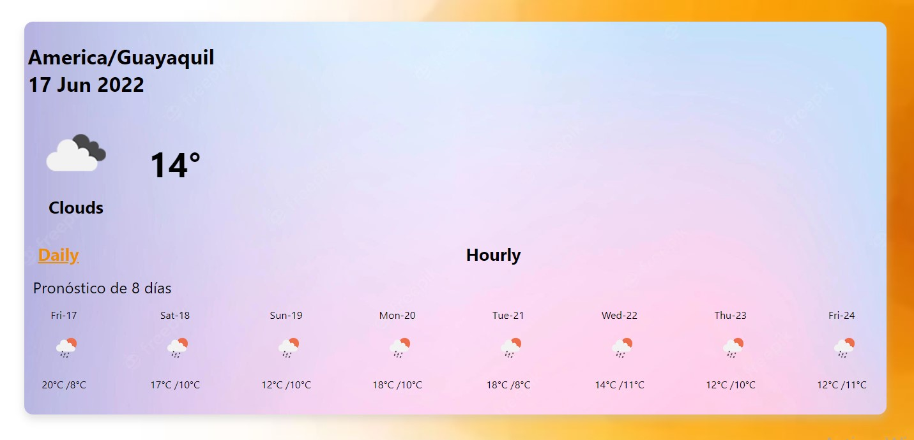

# Weather

###

El presente proyecto se realizó:

1.- Consumo de API [OpenWeather](https://openweathermap.org/)

2.- El proyecto permite ver la información de una latitud y longitud específica, en este caso de Ecuador-Guayaquil

3.- Permite ver el pronóstico por día ( ocho días)

4.- Permite ver el pronóstico por hora ( 48 horas)

5.- Permite ver el clima actual

### Project image

###

Para realizar el proyecto utilice las siguientes tecnologías:  
⚡HTML  
⚡Javascript  
⚡React  
⚡Redux  
⚡Sass  

## Available Scripts

In the project directory, you can run:

### `npm start`

Runs the app in the development mode.\
Open [http://localhost:3000](http://localhost:3000) to view it in your browser.

The page will reload when you make changes.\
You may also see any lint errors in the console.

### `npm run build`

Builds the app for production to the `build` folder.\
It correctly bundles React in production mode and optimizes the build for the best performance.

The build is minified and the filenames include the hashes.\
Your app is ready to be deployed!

See the section about [deployment](https://facebook.github.io/create-react-app/docs/deployment) for more information.
